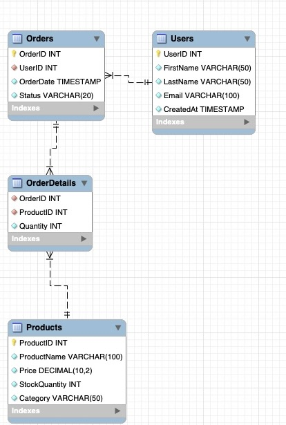

## Database Description and Purpose

Our database is meant to model a store. The database has 4 tables: Users, Products, Orders, and OrderDetails.

## Schema Picture


## Sample Question that worked well:

- Question: How much has each user spent all time? I would like to know the user's first name, last name, and total spent
- Model SQL Query: 
```
SELECT Users.FirstName, Users.LastName, SUM(Products.Price * OrderDetails.Quantity) AS TotalSpent
FROM Users
JOIN Orders ON Users.UserID = Orders.UserID
JOIN OrderDetails ON Orders.OrderID = OrderDetails.OrderID
JOIN Products ON OrderDetails.ProductID = Products.ProductID
GROUP BY Users.UserID, Users.FirstName, Users.LastName;
```
- Output:
```
[
  ('Carol', 'Williams', Decimal('150.00')),
  ('Eve', 'Davis', Decimal('3200.00')),
  ('David', 'Brown', Decimal('25.00')),
  ('Bob', 'Johnson', Decimal('900.00')),
  ('Alice', 'Smith', Decimal('1200.00'))
]
```

## Sample Question that did not work well:

- Question: How much total has Alice spent all time?
- Model SQL Query: 
```
SELECT SUM(Product.Price * OrderDetails.Quantity) AS TotalSpent
FROM Users
JOIN Orders ON Users.UserID = Orders.UserID
JOIN OrderDetails ON Orders.OrderID = OrderDetails.OrderID
JOIN Products ON OrderDetails.ProductID = Products.ProductID
WHERE Users.FirstName = 'Alice';
```
- Output: 
```
Traceback (most recent call last):
  File "/Users/tylertrommlitz/Documents/Projects/natural-language-sql-project/main.py", line 54, in execute_query
    cursor.execute(query)
psycopg2.errors.UndefinedTable: missing FROM-clause entry for table "product"
LINE 1: SELECT SUM(Product.Price * OrderDetails.Quantity) AS TotalSp...
```

## 6 More Query Examples